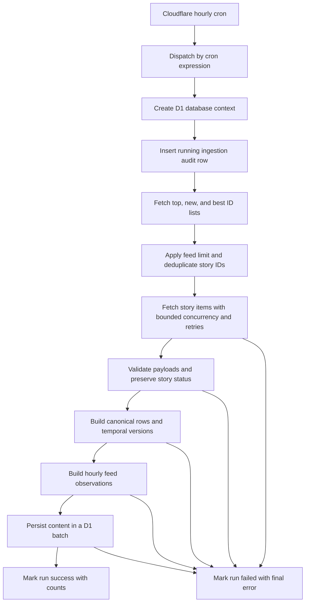

# Hacker News Hourly Ingestion Plan

**Status:** Implemented locally on 2026-08-12; remote migration and deployment
remain pending.

**Implementation note:** The initial deployed constant is 15 IDs per feed, not
the proposed 100 below. This keeps the job within the Workers Free limit of 50
external subrequests (3 feed requests plus up to 45 unique story requests).
Raise it to 100 only after confirming the deployed account uses Workers Paid.

## 1. Overview

HackerFeed will ingest Hacker News story metadata into the existing Cloudflare D1 database once per hour. The ingestion will collect the `top`, `new`, and `best` feeds, fetch the selected story records, upsert their latest canonical values, preserve application-managed temporal versions of changing story state, and record hourly feed-rank observations.

The existing browser-facing Hacker News feed will continue to use the live Hacker News API during this phase. This plan creates the stored dataset only; it does not change the product experience yet.

## 2. Scope

### In scope

- Run one Hacker News ingestion job every hour.
- Use the existing Cloudflare Worker, cron triggers, D1 binding, Drizzle schema, and repository/service boundaries.
- Fetch story IDs from the official Hacker News Firebase API:
  - `topstories.json`
  - `newstories.json`
  - `beststories.json`
- Fetch and validate each selected `item/{id}.json` story.
- Store one canonical row per Hacker News story in the existing `stories` table.
- Update mutable story metadata when a story is observed again.
- Store temporal story versions with `validFrom`/`validTo` ranges whenever normalized story state changes.
- Preserve active, dead, and deleted status transitions in temporal history when those states are returned for a selected story ID.
- Store an hourly feed observation containing feed membership/rank and a reference to the effective story version.
- Record every ingestion attempt with status, timestamps, counts, and a final error message.
- Make rerunning the same scheduled hour safe and idempotent.
- Add focused tests and operational documentation for the ingestion path.

### Explicitly out of scope

- Keyword extraction or keyword tagging.
- User-selected interests.
- Interest inference from views, favorites, papers, or stories.
- Recommendations or a “For You” feed.
- Embeddings, vector search, classifiers, or LLM calls.
- Analytics calculations, pitch statistics, dashboards, or reports.
- Combining Hacker News stories with Hugging Face papers.
- Serving the user-facing Hacker News feed from D1.
- Changes to favorites or view tracking.
- Ingesting Hacker News comments.
- Crawling, scraping, or storing the full text of external articles linked by Hacker News.
- A public or secret HTTP endpoint that triggers ingestion.
- Historical backfill beyond the stories visible in the selected feeds when ingestion begins.

These ideas may use the ingested dataset later, but they are not part of this implementation.

## 3. Definition of a Stored Story

For this plan, a “news article” means a valid Hacker News item with `type = "story"`. The stored data is the Hacker News story metadata already represented by `HackerNewsStoryRecord`:

- Hacker News story ID
- title
- external URL, when present
- Hacker News text, when present
- author username
- Hacker News creation time
- score
- comment count
- child comment IDs
- active, dead, or deleted availability status

The ingestion does not request or store the body of the external website referenced by the story URL.

Active, dead, and deleted story payloads are persisted as temporal states when the Hacker News response identifies the item as a story. Missing, malformed, and non-story items are skipped and counted. A missing response is not treated as a deletion because it does not prove a story-status transition. The hourly job does not keep refetching every historical story after it leaves the selected feed windows, so status changes are recorded only while an ID is selected and fetched.

## 4. Source and Schedule

### API base URL

```text
https://hacker-news.firebaseio.com/v0
```

### Feed requests

```text
GET /topstories.json
GET /newstories.json
GET /beststories.json
```

### Story request

```text
GET /item/{storyId}.json
```

### Cron

Add an hourly cron alongside the existing daily paper cron:

```jsonc
"triggers": {
  "crons": [
    "0 * * * *",
    "30 23 * * *"
  ]
}
```

`0 * * * *` runs the Hacker News ingestion at the start of every UTC hour. Hacker News is a continuously updated global source, so no local-time conversion is required.

### Required scheduler dispatch change

The current Worker runs the paper ingestion for every scheduled event. Before adding the hourly trigger, `src/server.ts` must dispatch by `controller.cron`:

```text
0 * * * *     -> Hacker News hourly ingestion
30 23 * * *  -> Hugging Face daily paper ingestion
unknown cron  -> log and exit without running either job
```

Without this dispatch, adding the hourly cron would also run the paper ingestion every hour.

Use `controller.scheduledTime` as the source for the UTC observation hour. This makes retries deterministic even if execution starts late.

## 5. Initial Feed Size

### Proposed starting value

Start with the first **100 IDs per feed** for `top`, `new`, and `best`.

The ingestion must deduplicate IDs across feeds before fetching item details, so a story present in multiple feeds is fetched only once per run. The maximum planned request count is therefore:

```text
3 feed requests + up to 300 unique story requests
```

The actual total should normally be lower because feed membership overlaps.

### Pre-implementation gate

Before implementation, confirm that the deployed Cloudflare Workers plan permits the worst-case outbound subrequest count for one invocation. If it does not, lower the per-feed limit before coding. Do not silently truncate during execution; the selected limit should be an explicit server constant and recorded on each ingestion run.

This is the only unresolved deployment decision in the v1 plan.

## 6. Runtime Flow



Detailed sequence:

1. Receive the hourly scheduled event.
2. Compute `observedHour` from `controller.scheduledTime`, truncated to an ISO UTC hour.
3. Insert an `hn_ingestion_runs` row with `status = running`.
4. Fetch all three feed ID lists.
5. Validate IDs, preserve rank within each feed, and keep the first configured number per feed.
6. Build the union of selected IDs so each story is requested once.
7. Fetch item details with bounded concurrency.
8. Retry only transient request failures.
9. Validate and normalize story payloads while preserving active, dead, and deleted status.
10. Skip missing, malformed, and non-story records.
11. Upsert canonical `stories` rows with the latest known state.
12. Compare each story with its current open temporal version.
13. If state changed, close the previous version and insert the new `hn_story_versions` row; otherwise reuse the open version.
14. Upsert one feed observation per `(observedHour, storyId)`, including nullable ranks for all three feeds and the effective story-version ID.
15. Persist canonical rows, version changes, and feed observations through D1 batch/transaction-style execution.
16. Mark the ingestion run `success` and store counts.
17. On a final fetch, validation, or D1 failure, mark the run `failed`, store a bounded error message, and rethrow so Cloudflare/Sentry records the failed job.

## 7. Data Model

The ingestion should reuse the existing `stories` table for the latest canonical state and add a separate application-managed temporal table for history.

Cloudflare D1 is SQLite-based and does not provide native SQL system-versioned temporal tables. Therefore, the ingestion service must maintain validity ranges explicitly. In this plan, `validFrom` means “the first scheduled ingestion hour when this state was observed,” not the exact instant when Hacker News changed the item. `validTo` is exclusive; a null value identifies the current open version.

### 7.1 Changes to `stories`

Keep the existing columns:

```text
id
hnStoryId
title
url
text
score
hnPostedAt
authorUsername
commentCount
commentIds
```

Add the latest availability status and ingestion timestamps:

```text
availabilityStatus TEXT NOT NULL DEFAULT 'active'  -- active | dead | deleted
firstIngestedAt TEXT
lastIngestedAt TEXT
```

Migration behavior for existing story rows created by favorites or view activity:

- Existing rows receive `availabilityStatus = active`.
- Existing rows may initially have `firstIngestedAt = NULL` and `lastIngestedAt = NULL`.
- The first hourly ingestion sets both timestamps.
- Later ingestions preserve `firstIngestedAt` and update `lastIngestedAt`.
- Favorites and view tracking must continue to work without supplying ingestion timestamps.

The canonical row is a current-state projection for existing foreign keys and fast reads. It is not the source of historical truth; historical values belong in `hn_story_versions`.

When dead or deleted payloads omit previously known metadata, do not erase useful canonical title, URL, text, author, or posting-time values. Update `availabilityStatus`, mutable values that are actually present, and the temporal history.

### 7.2 `hn_story_versions` temporal table

Store one version whenever normalized story state changes:

```text
id TEXT PRIMARY KEY
ingestionRunId TEXT NOT NULL REFERENCES hn_ingestion_runs(id)
storyId TEXT NOT NULL REFERENCES stories(id) ON DELETE CASCADE
availabilityStatus TEXT NOT NULL  -- active | dead | deleted
title TEXT
url TEXT
text TEXT
score INTEGER NOT NULL
hnPostedAt TEXT
authorUsername TEXT
commentCount INTEGER NOT NULL
commentIds TEXT NOT NULL
validFrom TEXT NOT NULL
validTo TEXT
recordedAt TEXT NOT NULL
UNIQUE (storyId, validFrom)
```

Temporal constraints and indexes:

```text
CHECK (availabilityStatus IN ('active', 'dead', 'deleted'))
CHECK (validTo IS NULL OR validTo > validFrom)
UNIQUE INDEX one open version per story WHERE validTo IS NULL
index(storyId, validFrom)
index(validFrom)
index(validTo)
```

Versioning rules:

- The first successful ingestion of a story inserts one open version with `validFrom = observedHour` and `validTo = NULL`.
- Compare all normalized versioned fields, including status, score, comment count, and comment IDs, with the current open version.
- If no versioned field changed, do not insert another version.
- If state changed in a later hour, set the current version’s `validTo` to that hour and insert a new open version beginning at the same hour.
- If a retry during the same hour sees changed state, update the version whose `validFrom` equals that hour rather than creating a zero-duration version.
- A dead or deleted response creates a status version. If the response omits metadata, carry forward the last known metadata into the new effective-state version rather than losing it.
- Missing, malformed, and non-story responses do not close the current version because they do not prove a state transition.
- Leaving all selected feed windows does not close the temporal version. It is represented by the absence of a feed observation in a successful later run, and the story is not refetched solely to discover a later status change.

Example timeline:

```text
10:00 active, score 120  -> validFrom 10:00, validTo 11:00
11:00 active, score 145  -> validFrom 11:00, validTo 13:00
12:00 unchanged          -> no new version
13:00 deleted            -> validFrom 13:00, validTo NULL
```

This is a single observation-time temporal model, not a bitemporal model. The first implementation does not track a separate business-effective timestamp because the Hacker News API does not provide the exact time at which these fields changed.

### 7.3 `hn_story_feed_observations`

Store one deduplicated feed observation per story per UTC hour:

```text
id TEXT PRIMARY KEY
ingestionRunId TEXT NOT NULL REFERENCES hn_ingestion_runs(id)
storyId TEXT NOT NULL REFERENCES stories(id) ON DELETE CASCADE
storyVersionId TEXT NOT NULL REFERENCES hn_story_versions(id) ON DELETE RESTRICT
observedHour TEXT NOT NULL
topRank INTEGER
newRank INTEGER
bestRank INTEGER
createdAt TEXT NOT NULL
updatedAt TEXT NOT NULL
UNIQUE (observedHour, storyId)
```

Rank rules:

- Ranks start at `1` and preserve the order returned by Hacker News.
- A rank is `NULL` when the story was not in that selected feed window.
- At least one of `topRank`, `newRank`, or `bestRank` must be non-null.
- `storyVersionId` references the story state effective for that observation hour, avoiding duplicated story payload fields in the feed table.

Indexes:

```text
index(observedHour)
index(storyId, observedHour)
index(storyVersionId)
index(observedHour, topRank)
index(observedHour, newRank)
index(observedHour, bestRank)
```

Why both temporal versions and feed observations are needed:

- Story state and feed position are different facts with different change patterns.
- `hn_story_versions` answers what the story payload looked like over time.
- `hn_story_feed_observations` answers where that version appeared in each hourly feed.
- Upserting only `stories` would discard both kinds of history.
- Separating the tables avoids repeating title, URL, text, score, comments, and comment IDs merely because rank changed.

### 7.4 `hn_ingestion_runs`

Store one audit row per execution attempt:

```text
id TEXT PRIMARY KEY
observedHour TEXT NOT NULL
status TEXT NOT NULL  -- running | success | failed
startedAt TEXT NOT NULL
finishedAt TEXT
sourceBaseUrl TEXT NOT NULL
perFeedLimit INTEGER NOT NULL
topIdCount INTEGER
newIdCount INTEGER
bestIdCount INTEGER
uniqueSelectedCount INTEGER
fetchedCount INTEGER
persistedStoryCount INTEGER
insertedVersionCount INTEGER
persistedFeedObservationCount INTEGER
skippedCount INTEGER
errorMessage TEXT
createdAt TEXT NOT NULL
updatedAt TEXT NOT NULL
```

Multiple run attempts for the same `observedHour` are allowed for auditability. Content remains idempotent because versions use the same-hour retry rules and feed observations are upserted by `(observedHour, storyId)`.

Do not automatically delete stale `running` rows. A stale row is useful evidence of a Worker crash or timeout.

## 8. Idempotency and Update Rules

### Canonical story

Upsert by `stories.hnStoryId`:

- Insert a new canonical row when the story is first seen.
- Update active story metadata when it is seen again.
- For dead/deleted responses, preserve previously known metadata when fields are omitted and update `availabilityStatus`.
- Preserve the original `firstIngestedAt`.
- Set `lastIngestedAt` to the current observation hour.

### Temporal story version

Resolve the current row where `storyId` matches and `validTo IS NULL`:

- Insert an open version on first ingestion.
- Reuse the open version when all normalized versioned fields are unchanged.
- Close and replace the open version when state changes in a later hour.
- Update the same version when a same-hour retry observes a change.
- Never allow two open versions for one story.
- Never create overlapping or zero-duration validity ranges.

### Hourly feed observation

Upsert by `(observedHour, storyId)`:

- A retry for the same scheduled hour updates the existing feed observation.
- The latest successful retry may replace ranks, `storyVersionId`, and `ingestionRunId` for that hour.
- A run for a later hour inserts a new feed observation.

### Failure handling

- Insert the run audit row before network requests begin.
- Do not write temporal versions or feed observations until all three feed lists have been fetched successfully.
- Retry transient story fetch failures before failing the run.
- Dead/deleted story states are valid temporal changes; missing, malformed, and non-story items are expected skips.
- Persist canonical stories, temporal version changes, and feed observations in one D1 batch or equivalent transaction-style operation so a failed content write does not leave a partially recorded hour.
- Keep audit-row writes separate so failure status survives a content-write rollback.

## 9. Fetching, Validation, and Retry Policy

### Request headers

```text
Accept: application/json
User-Agent: hackerfeed-web/1.0
```

### Bounded concurrency

Fetch story details concurrently, but use a fixed small worker pool rather than an unbounded `Promise.all` over every selected ID. A starting concurrency of `10` is sufficient for the first implementation and should remain a server constant.

### Retry policy

Use at most three attempts per HTTP request:

```text
attempt 1 -> immediate
attempt 2 -> after 1 second
attempt 3 -> after 3 seconds
```

Retry:

- network errors
- HTTP `429`
- HTTP `5xx`

Do not retry other HTTP `4xx` responses.

### Shared normalization

The current normalization logic lives in `src/lib/hacker-news/queries.ts`, which also contains React Query code. Before adding the server ingestion client, extract the pure Hacker News record types and normalization functions into a client/server-safe module under `src/lib/hacker-news/`.

Both paths must share field validation and active-story normalization:

- existing live Hacker News queries
- new server-only hourly ingestion

The ingestion parser must additionally preserve `dead` and `deleted` as explicit status results instead of collapsing them to `null`. The existing UI may continue hiding those results. This keeps validation consistent while allowing the temporal table to record status transitions.

## 10. Proposed Server Modules

```text
src/lib/hacker-news/
  schemas.ts                 # shared types and pure normalization
  queries.ts                 # existing live UI query functions

src/server/hacker-news-ingestion/
  client.ts                  # server-only HN feed/item HTTP client and retries
  client.test.ts
  repository.ts              # D1 audit, canonical upserts, versions, feed observations
  repository.test.ts
  ingestion.ts               # hourly orchestration
  ingestion.test.ts
```

Continue reusing:

```text
src/server/database/schema.ts
src/server/database/client.ts
src/server/stories/persistence.ts
src/server.ts
```

No tRPC router is required because ingestion is internal scheduled work and no new user-facing read API is part of this phase.

## 11. Implementation Sequence

### Issue 1: Add the ingestion schema

**What to build**

- Add `availabilityStatus`, `firstIngestedAt`, and `lastIngestedAt` to `stories`.
- Add `hn_ingestion_runs`.
- Add the `hn_story_versions` temporal table with validity constraints and one-open-version enforcement.
- Add `hn_story_feed_observations` with constraints and indexes.
- Generate and review the Drizzle migration.

**Acceptance criteria**

- [ ] Existing favorites and story-view persistence can still create/update stories.
- [ ] One story can have no more than one open temporal version.
- [ ] Temporal validity ranges cannot overlap or have zero duration.
- [ ] A story can have only one feed observation per UTC hour.
- [ ] A feed observation can preserve all three feed ranks and reference its effective story version.
- [ ] Rank values are null or greater than/equal to `1`.
- [ ] At least one feed rank is present on every feed observation.
- [ ] Story status accepts only `active`, `dead`, or `deleted`.
- [ ] Ingestion run status accepts only `running`, `success`, or `failed`.
- [ ] Local migration applies successfully.
- [ ] `bun run check` passes.

### Issue 2: Add the server-only Hacker News client

**What to build**

- Extract shared story normalization from the React Query module.
- Fetch and validate `top`, `new`, and `best` ID lists.
- Fetch deduplicated item details with bounded concurrency.
- Add the retry policy.

**Acceptance criteria**

- [ ] Feed IDs are positive integers and duplicates within a feed are removed without changing order.
- [ ] Feed ranks start at `1` after applying the configured limit.
- [ ] A story present in multiple feeds is fetched once.
- [ ] Active, dead, and deleted story payloads normalize to distinct typed status results.
- [ ] Missing, malformed, and non-story items normalize to skipped results.
- [ ] The existing live UI can continue filtering dead and deleted results.
- [ ] Network errors, `429`, and `5xx` responses are retried at most three times.
- [ ] Other `4xx` responses fail without retry.
- [ ] Story fetch concurrency is bounded.
- [ ] Existing live-feed normalization behavior remains unchanged.
- [ ] Focused client and normalization tests pass.

### Issue 3: Add idempotent ingestion persistence and orchestration

**What to build**

- Create the ingestion run before fetching.
- Build canonical story values.
- Compare against open story versions and construct required temporal changes.
- Build deduplicated hourly feed observations linked to effective versions.
- Persist the content batch.
- Complete the run as success or failed.

**Acceptance criteria**

- [ ] New stories are inserted by `hnStoryId`.
- [ ] Existing canonical story metadata is refreshed without erasing last-known metadata omitted from dead/deleted payloads.
- [ ] First/last ingestion timestamps follow the update rules.
- [ ] The first observed story state creates an open temporal version.
- [ ] An unchanged story reuses its open version.
- [ ] A changed story closes the previous version and opens a non-overlapping replacement.
- [ ] Same-hour retries update rather than duplicate the hour’s version.
- [ ] Dead and deleted transitions are recorded as versions.
- [ ] Feed observations reference the effective story version and preserve source ranks.
- [ ] Rerunning the same hour does not duplicate stories, versions, or feed observations.
- [ ] A later hour creates a new feed observation and creates a version only when story state changed.
- [ ] Successful runs contain source, story, version, feed-observation, and skip counts.
- [ ] Failed runs contain `finishedAt` and a bounded error message.
- [ ] Content write failures do not leave partial canonical, temporal, or feed-observation changes.
- [ ] Focused repository and ingestion tests pass.

### Issue 4: Wire the hourly Cloudflare schedule

**What to build**

- Add `0 * * * *` to `wrangler.jsonc` without removing the paper cron.
- Dispatch scheduled jobs by `controller.cron` in `src/server.ts`.
- Pass the scheduled timestamp into the Hacker News ingestion.
- Add structured start, success, skip, and failure logs.
- Update root project documentation with the two schedules and migration instructions.

**Acceptance criteria**

- [ ] The hourly cron runs only Hacker News ingestion.
- [ ] The daily cron runs only Hugging Face paper ingestion.
- [ ] An unknown cron expression runs neither ingestion.
- [ ] Both jobs continue using `context.waitUntil(...)`.
- [ ] No HTTP ingestion route is added.
- [ ] Logs include run ID, observation hour, configured limit, selected count, persisted count, skipped count, duration, and final status.
- [ ] Scheduled dispatch tests pass.
- [ ] `bun run check`, focused tests, and `bun run test` pass.

## 12. Testing Strategy

### Pure unit tests

- Feed ID validation and stable deduplication.
- Per-feed limit and one-based rank assignment.
- Cross-feed deduplication.
- Active, dead, deleted, and skipped normalization cases.
- UTC observation-hour calculation from scheduled time.
- Temporal state equality and change detection.
- Validity-range transitions, including same-hour retries.
- Retryable and non-retryable responses.
- Bounded concurrency behavior.
- Feed-observation projection for stories in one, two, or all three feeds.

### Repository tests

Follow the existing repository-test style with a controlled database dependency:

- new canonical story insert
- existing story update
- dead/deleted canonical metadata preservation
- first/last ingestion timestamp behavior
- first temporal version insert
- unchanged-state version reuse
- changed-state close-and-insert behavior
- one-open-version enforcement
- same-hour retry behavior
- non-overlapping validity ranges
- same-hour feed-observation upsert
- later-hour feed-observation insert
- effective story-version reference
- run success and failure updates
- batch failure behavior

### Scheduler tests

- hourly cron dispatches only Hacker News ingestion
- paper cron dispatches only paper ingestion
- unknown cron dispatches no ingestion
- scheduled timestamp is forwarded unchanged

### Validation commands

```bash
bun run db:generate --name hacker_news_hourly_ingestion
bun run db:migrate:local
bunx vitest run <focused test files>
bun run check
bun run test
bun run build
```

Migration generation and implementation commands are listed for the later implementation phase; this planning task does not run them.

## 13. Operational Behavior

### Logging

Emit structured logs for:

- ingestion started
- feed lists fetched
- story batch fetched
- skipped item summary
- content persisted
- ingestion succeeded
- ingestion failed

Do not log full story text or entire API payloads. Log IDs, counts, timings, statuses, and bounded error messages.

### Monitoring

The existing Cloudflare/Sentry instrumentation should capture scheduled-job failures. No new dashboard or alerting system is required for v1, but failed and stale-running audit rows must remain queryable in D1.

### Data growth

At 100 entries per feed, the absolute upper bound is 300 deduplicated feed observations per hour:

```text
300 × 24 = 7,200 feed observations/day
approximately 2.63 million feed observations/year
```

Temporal versions are inserted only when story state changes. Because score and comment activity may change hourly, the conservative upper bound is another version per observed story per hour, although inactive stories should create fewer versions.

Actual volume should be lower because the feeds overlap and unchanged states reuse their open version. Do not add deletion or aggregation in v1. Review D1 storage growth after the first month before defining a retention policy; preserving temporal versions and raw hourly feed observations is preferred until future data needs are known.

## 14. Rollout

1. Confirm the Cloudflare outbound subrequest allowance and finalize the per-feed limit.
2. Implement and apply the schema migration locally.
3. Run focused tests, the full test suite, checks, and a production build.
4. Apply the D1 migration remotely before deploying code that writes the new tables.
5. Deploy the Worker with both cron triggers and cron-based dispatch.
6. Verify the first hourly `hn_ingestion_runs` row reaches `success`.
7. Verify canonical stories, temporal versions, and feed observations were written with expected counts, validity ranges, and ranks.
8. Observe several hourly executions for failures, duration, and storage growth.

Rollback should disable only the hourly cron/dispatch path. The new tables and nullable story columns can remain in place; dropping them is not required for an operational rollback.

## 15. Completion Criteria

The ingestion phase is complete when:

- Hacker News ingestion runs once per UTC hour.
- Paper ingestion still runs only on its existing daily schedule.
- The selected `top`, `new`, and `best` story metadata is stored in D1.
- Canonical stories update safely without duplicates.
- Story-state changes are preserved in non-overlapping temporal versions with no more than one open version per story.
- Dead and deleted status transitions returned for selected story IDs are retained in temporal history.
- Hourly feed ranks reference the effective story version and are preserved idempotently.
- Every run is auditable as running, successful, or failed.
- Missing, malformed, and non-story items are skipped safely.
- No recommendation, keyword, interest, analytics, content-scraping, UI, or tRPC feature has been added.
- Focused tests, the full test suite, checks, and production build pass.
